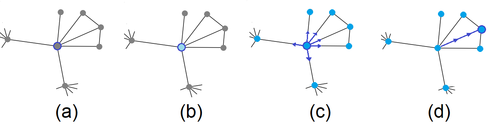

<h1 align="center">Parallel Competitive Learning</h1>

Overview:
=================

The proposed model is inspired by two unsupervised learning techniques. The first is the particle competition, in which the particles travel through the network trying to dominate as many nodes as possible while repelling the opposing particles. The second mechanism is a parallel signal propagation inspired by SOM.

In summary, the new methodology works as follows: (1) all the elements of the energy matrix are initialized with the established minimum value. (2) The initial positions of the particles are defined at the nodes with the greatest measure of proximity centrality. (3) At each iteration, particles propagate their energy in two ways: only for the visited node constituting sequential processing, and for all neighbors of the visited node to perform parallel processing. In both cases, the energy level of the actual particle at the nodes is increased and the energy level of rival particles is decreased. (4) Check each element of the energy matrix. If any of them have an energy value below the stated minimum, set it back to that value. (5) Each particle selects a neighboring node to visit according to walking probability. (6) This process is repeated until the system converges. 

Figure below, illustrates the description of the method detection process.

Algorithm:
=================
<!--ts-->
    The main steps of the algorithm's iteration procedure are explained below.
      Step 01: Input parameters are presented. In the case of weighted networks and/or graphs, set weight = TRUE; otherwise, weight = FALSE.
      Step 02: All elements of the energy matrix are initialized with the value E_min.
      Step 03: The initial positions of the K particles are defined at the nodes V with the greatest measure of proximity centrality.
      Step 05: Run the process up to a predefined limit value, or until the energy matrix converges.
      Step 07: Each of the K particles propagates the signal and updates the energy matrix.
      Step 08: Check each element of the energy matrix. If any of them have an energy value below E_min, set it back to E_min.
      Step 09: Calculation of the random walk transition matrix.
      Step 10: Calculation of the preferential walk transition matrix.
      Step 11: Select the next node by the combined rule of the random and preferential walk.
<!--te-->

<table border="1">
    <tr>
        <td>01: </td>
        <td>
<b>procedure</b> ParallelCompetition(<i>G, K, T</i>)
</td>
    </tr>
    <tr>
        <td>02: </td>
        <td>&nbsp;&nbsp;&nbsp;&nbsp;&nbsp;&nbsp;<i>E(0)</i> = initialEnergy(<i>G, K</i>)</td>
    </tr>
    <tr>
        <td>03: </td>
        <td>&nbsp;&nbsp;&nbsp;&nbsp;&nbsp;&nbsp;<i>P(0)</i> = initialParticle: Setting initial positions of the <i>K</i> particles</td>
    </tr>
    <tr>
        <td>04: </td>
        <td>&nbsp;&nbsp;&nbsp;&nbsp;&nbsp;&nbsp;<i>t = 1</i></td>
    </tr>
    <tr>
        <td>05: </td>
        <td>&nbsp;&nbsp;&nbsp;&nbsp;&nbsp;&nbsp;<b>while</b> <i>t &lt; T</i> and <i>||E(t) - E(t-1)|| &ge; &Epsilon; </i></td>
    </tr>
    <tr>
        <td>06: </td>
        <td>&nbsp;&nbsp;&nbsp;&nbsp;&nbsp;&nbsp;&nbsp;&nbsp;&nbsp;&nbsp;&nbsp;&nbsp;<b>for</b> <i>k = 1</i> to <i>K</i></td>
    </tr>
    <tr>
        <td>07: </td>
        <td>&nbsp;&nbsp;&nbsp;&nbsp;&nbsp;&nbsp;&nbsp;&nbsp;&nbsp;&nbsp;&nbsp;&nbsp;&nbsp;&nbsp;&nbsp;&nbsp;&nbsp;&nbsp;propagationSignal(<i>G, E(k)</i>)</td>
    </tr>
    <tr>
        <td>08: </td>
        <td>&nbsp;&nbsp;&nbsp;&nbsp;&nbsp;&nbsp;&nbsp;&nbsp;&nbsp;&nbsp;&nbsp;&nbsp;&nbsp;&nbsp;&nbsp;&nbsp;&nbsp;&nbsp;checkEnergy(<i>G, E(k)</i>)</td>
    </tr>
    <tr>
        <td>09: </td>
        <td>&nbsp;&nbsp;&nbsp;&nbsp;&nbsp;&nbsp;&nbsp;&nbsp;&nbsp;&nbsp;&nbsp;&nbsp;&nbsp;&nbsp;&nbsp;&nbsp;&nbsp;&nbsp;calculate_<i>P_rand</i></td>
    </tr>
    <tr>
        <td>10: </td>
        <td>&nbsp;&nbsp;&nbsp;&nbsp;&nbsp;&nbsp;&nbsp;&nbsp;&nbsp;&nbsp;&nbsp;&nbsp;&nbsp;&nbsp;&nbsp;&nbsp;&nbsp;&nbsp;calculate_<i>P_pref</i></td>
    </tr>
    <tr>
        <td>11: </td>
        <td>&nbsp;&nbsp;&nbsp;&nbsp;&nbsp;&nbsp;&nbsp;&nbsp;&nbsp;&nbsp;&nbsp;&nbsp;&nbsp;&nbsp;&nbsp;&nbsp;&nbsp;&nbsp;selectnode(<i>G, K, P_rand, P_pref</i>)</td>
    </tr>
    <tr>
        <td>12: </td>
        <td>&nbsp;&nbsp;&nbsp;&nbsp;&nbsp;&nbsp;&nbsp;&nbsp;&nbsp;&nbsp;&nbsp;&nbsp;<b>end</b> for <i>k</i></td>
    </tr>
    <tr>
        <td>13: </td>
        <td>&nbsp;&nbsp;&nbsp;&nbsp;&nbsp;&nbsp;<i>t = t + 1</i></td>
    </tr>
    <tr>
        <td>14: </td>
        <td>&nbsp;&nbsp;&nbsp;&nbsp;&nbsp;&nbsp;<b>end while</b></td>
    </tr>
    <tr>
        <td>15: </td>
        <td>
<b>end procedure</b>
</td>
    </tr>
</table>

<h3>For complete project information, visit: <a href="https://www.teses.usp.br/teses/disponiveis/59/59143/tde-01072022-152719/pt-br.php">here</a></h3>

